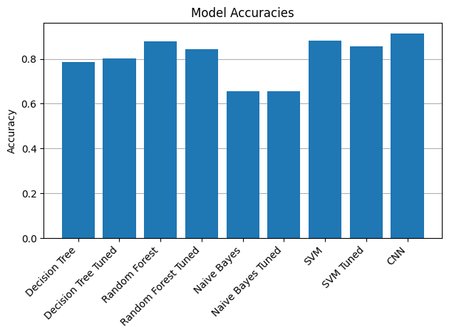

# Multiclass Classification Models comparison

The project is made to recognize the best models in classifying the fasion_mnist dataset.  
I highly encourage you to go through 'comparison.ipynb' to see the development process.

## Optimizations

After original deplyoment i used GridSearch in order to tune parameters of some of the models.  
Due to performance issues i had to shorten the dataset to 10% of its original size for optimiziation purposes.  
A very interesting thing then occured which can be seen in results. When we fit the data too well to a portion of the dataset, and we run the model again with changed parameters, we can see the effectiveness drops. This occurence is called overfitting.

## Results
  
As we can see the Convolutional Neural Network worked great in classyfing the fashion_mnist images. Different models, a bit less hardware consuming, but still with decent results are Random Forest Classifier and Support Vector Machines.  
If time is a huge issue and accuracy is not so, I would recommend Naive Bayes model since it takes seconds to run.
## Authors

- [@woznin](https://www.github.com/woznin)

